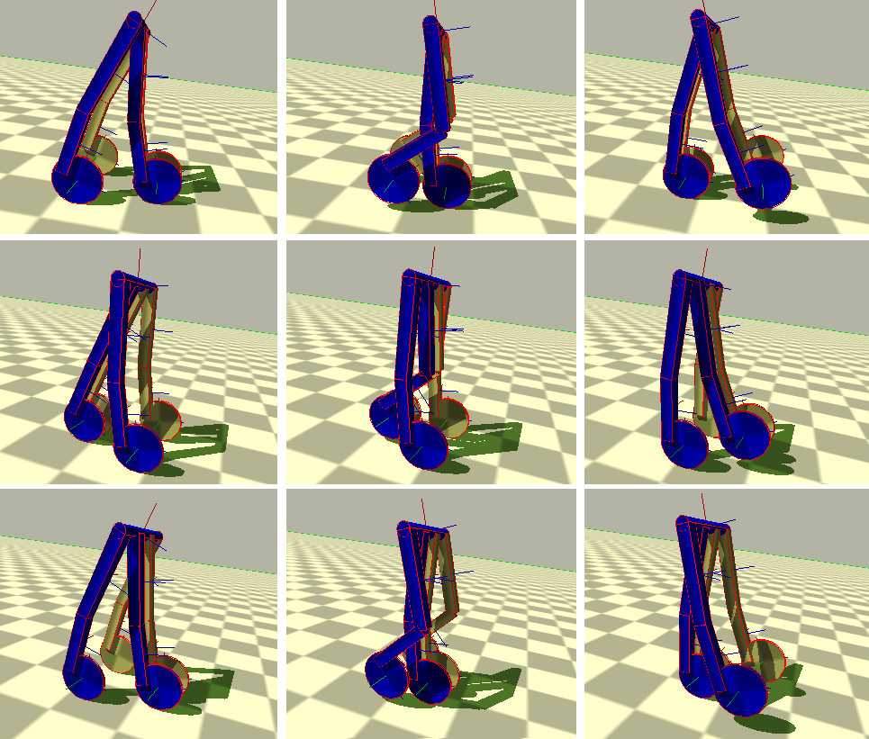

# Passive Walker

The purpose of this project was to model and simulate a passive walker using the bullet
physics engine. Advanced level tasks were to extend the passive walker model, add sensors and
motors, and implement a controlled active walker.

### Background

In 1987, McGeer started working on the concept of passive dynamic walking. Passive walking acts as a gait-like motion of a mechanism having no external actuation other than gravity. McGeer demonstrated by numerical and physical simulations models that some mechanisms could achieve bipedal walking on small slopes without actuators or control systems. These passive systems can generate stable walking patterns just by gravitational effects, and, in addition, these motions are natural and energy-optimal.

### Note

The project should be placed inside the bullet folder.
(The code was tested with bullet-2.80-rev2531).
